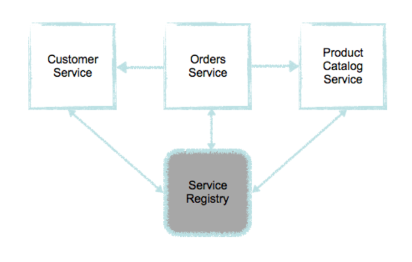

# Microservices TKD case

Build a small webshop application by applying the microservices architecture pattern. 

The application should make it possible to perform the following operations:
* Customers should be able to register/deregister themselves
* Customers should be able to place/remove orders
* Employees should be able to change the state of an order
* Employees should be able to manage the product catalog, i.e. add, delete and update products

Service discovery is done through the service registry (no service connects directly to another service). Inter-service communication must be done in a synchronous way via REST / JSON. Services are also built in teams, with one team per service.

## Deployment

Deploy on your local machine on each minimal increment. This should not need to be coordinated with other teams.

## API
Communicate between teams to agree on the API. This is timeboxed to the first 5 minutes of every sprint. 

## Services

* [Customer service](customerservice.md)
* [Product catalog service](productcatalogservice.md)
* [Order service](orderservice.md)

## Backend for frontend (BFF)

There is also a need to create a BFF component that acts as a gateway to underlying components.

* [Customer gateway](customergateway.md)
* [Employee gateway](employeegateway.md)
